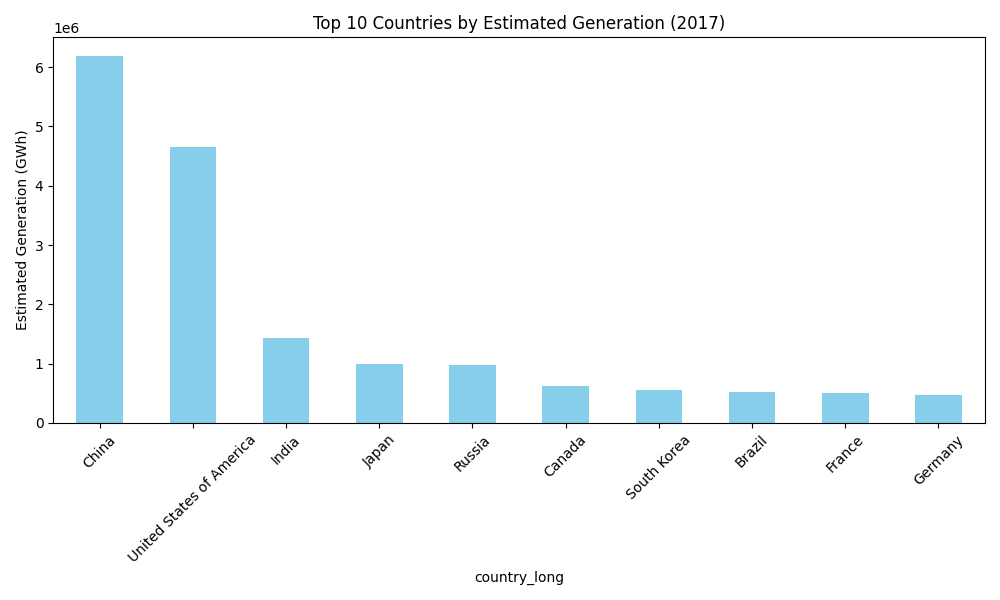

# 🌍 Global Power Generation Analysis & Forecasting

This project analyzes the Global Power Plant Database to:
- Visualize power generation trends by country and fuel type
- Explore historical generation data (2013–2017)
- Predict future energy generation up to 2030 using machine learning (Linear Regression)

---

## 📊 Features

- Top 10 countries by estimated power generation (bar chart)
- Global generation by fuel type (bar chart)
- Country-level time trend analysis (line chart)
- Future forecast (2018–2030) using ML model
- Interactive plots with `matplotlib`

---

## 🧠 Tech Stack

- Python 3.11
- pandas, matplotlib
- scikit-learn (LinearRegression)
- [Optional] xgboost, statsmodels for advanced ML

---

## ▶️ How to Run

1. Clone this repo or download the files  
2. Install dependencies:

```bash
pip install pandas matplotlib scikit-learn
```

(Optional for advanced models)

```bash
pip install xgboost statsmodels
```

3. Run the script:

```bash
python power_analysis.py
```

4. Follow the prompts and view the interactive charts.

---

## 🌐 Data Source

- [Global Power Plant Database](https://datasets.wri.org/dataset/globalpowerplantdatabase)

---

## 📸 Example Outputs

### 🔹 Top 10 Countries by Generation


### 🔹 Global Generation by Fuel Type


### 🔹 Country Trend: Bangladesh (2013–2017)


### 🔹 Forecast (2018–2030)


---

## ✍️ Author

Built by [Your Name] for personal learning and energy data exploration.
